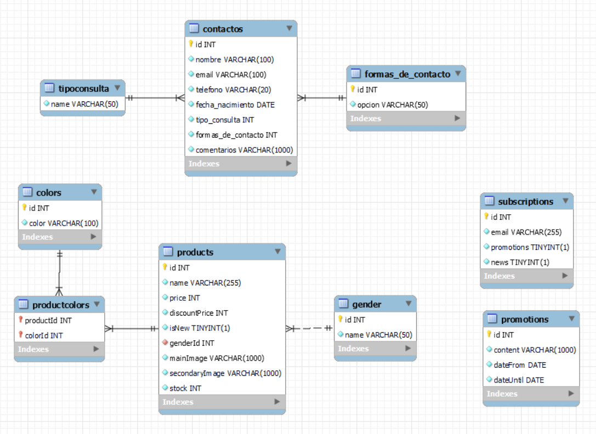

# Trabajo práctico Codo a Codo
# Node.JS - Curso 24122 - Grupo 14 - Backend

## Integrantes
- Gladys Vilaro (vilarogladys1989@gmail.com)
- José Luís Claros (claros.vilca@gmail.com)
- Raúl Medina (raul@medina.net.ar)

## Módulos utilizados
```sh
npm install express
npm install mysql2
npm install node-mailjet
npm install jsonwebtoken
npm install cors
```

## Postman Test Data

El siguiente archivo JSON ha sido exportado desde Postman y contiene todos los datos necesarios para realizar pruebas. Solo debe importar este archivo en Postman para acceder a las solicitudes de prueba preconfiguradas.

```sh
https://github.com/raulmedinaAR/Grupo14-NodeJS-Backend/blob/main/testData/postman_collection.json
```

## Criterios de evaluación:

### 1) La base de datos debe desarrollarse com MySQL, tener al menos 4 tablas, con al menos 4 diferentes tipos de datos.



Los scripts de generación de la base de datos se encuntran dentro del repositorio en la carpeta `/src/db/scripts`.

### 2) Entre las tablas al menos deberá haber una relación "uno a muchos".

- Ver imagen anterior

### 3) A través del servidor levantado con Node y Express se debe poder realizar al menos un tipo de alta. (POST)
| Método | Descripción | Ruta | Body | Back | Front |
| ------ | ------ | ------ | ------ | ------ | ------ |
| **POST** | Agregar suscripción | `/subscription` | {"email": "raul@medina.net.ar"} | &#x2714; | &#x2714; |
| **POST** | Agregar contacto | `/form` | {"nombre":"Raul", "email":"raul@medina.net.ar", "telefono":"1122334455", "fecha_nacimiento":"2024-01-21", "tipo_consulta":1, "formas_de_contacto":2, "comentarios":"Buenas tardes, quería consultar por el precio mayorista de las prendas de mujer" } | &#x2714; | &#x2714; |

> **📝 Nota:** 
    Al realizarse la suscripción correctamente envía un email explicando los detalles de esta suscripción y la forma de cancelarla.
    Al enviarse el formulario de contacto también enviar un email confirmando que el contacto fue exitoso y mostrando todos los datos del mismo.


### 4) De la misma forma se debe poder realizar modificaciones de los registros. (PUT)
| Método | Descripción | Ruta | Body | Back | Front |
| ------ | ------ | ------ | ------ | ------ | ------ |
| **PUT** | Modificar suscripción | `/subscription` | {"email": "raul@medina.net.ar", "updateCode": 1} | &#x2714; | &#x2714; |

### 5) Se debe poder acceder a los registros de la tabla (GET)
| Método | Descripción | Ruta | Back | Front |
| ------ | ------ | ------ | ------ | ------ |
| **GET** | Obtener indumentaria femenina | `/products/woman` | &#x2714; | &#x2714;  |
| **GET** | Obtener indumentaria masculina | `/products/men` | &#x2714; | &#x2714;  |
| **GET** | Obtener promociones | `/promotions` | &#x2714; | &#x2714; |
| **GET** | Obtener nuevo token | `/token/new` | &#x2714; | &#x2714;  |

### 6) Se debe poder realizar borrado físico de los datos. (DELETE)
| Método | Descripción | Ruta | Body | Back | Front |
| ------ | ------ | ------ | ------ | ------ | ------ |
| **DELETE** | Eliminar suscripción | `/subscription` | {"email": "raul@medina.net.ar"} | &#x2714; | &#x2714; |

### 7) El trabajo práctico deberá subirse a un servidor online y compartirse mediante un repositorio de Git.
- [Repositorio en GitHub](https://github.com/raulmedinaAR/Grupo14-NodeJS-Backend.git)

### 8) La página deberá subirse a un servidor on-line para poder ser navegada por el Docente.
- [Visita nuestra versión navegable del backend](https://grupo14.alwaysdata.net/)

### 9) Se valorará la aplicación de un token o método de autenticación.
- Implementamos JSON Web Tokens (JWT) con el módulo `jsonwebtoken`.
- Cuando ingresamos a la página principal el frontend solicita un token al backend y lo guarda en el localStorage como se puede observar en la siguiente imagen:


### 10) El backend debe estar integrado con un frontend
- [Visita nuestra versión navegable del frontend integrado al backend](https://grupo14.netlify.app/)
- [Repositorio en GitHub del frontend integrado al backend](https://github.com/Glavilaro/Grupo_14_nodeJs.git)
